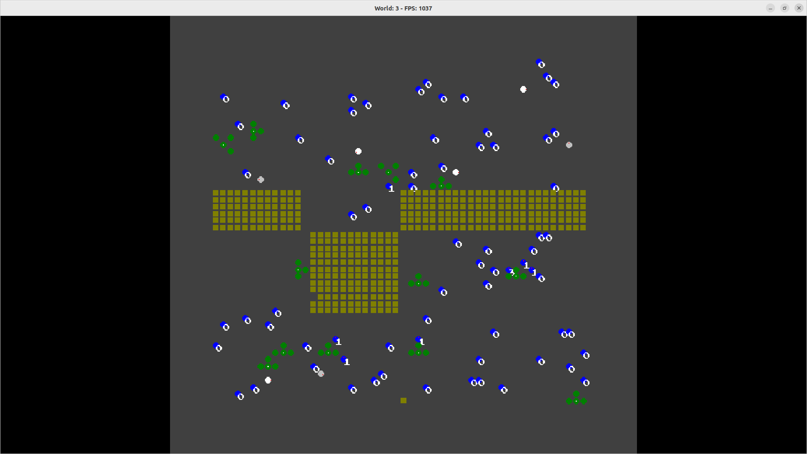
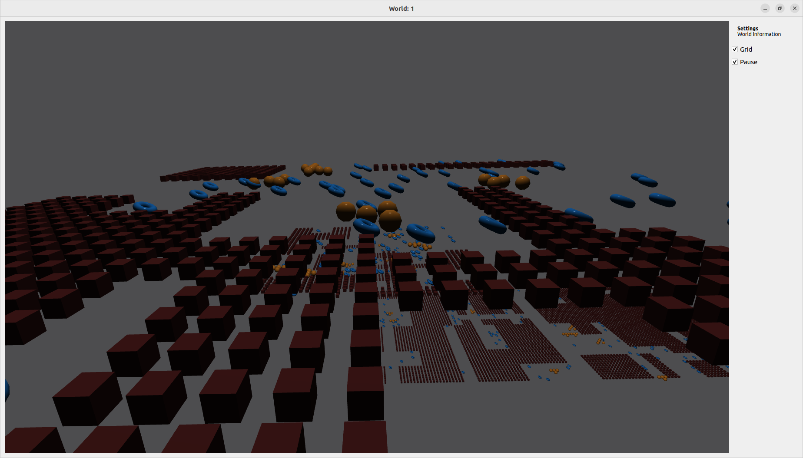
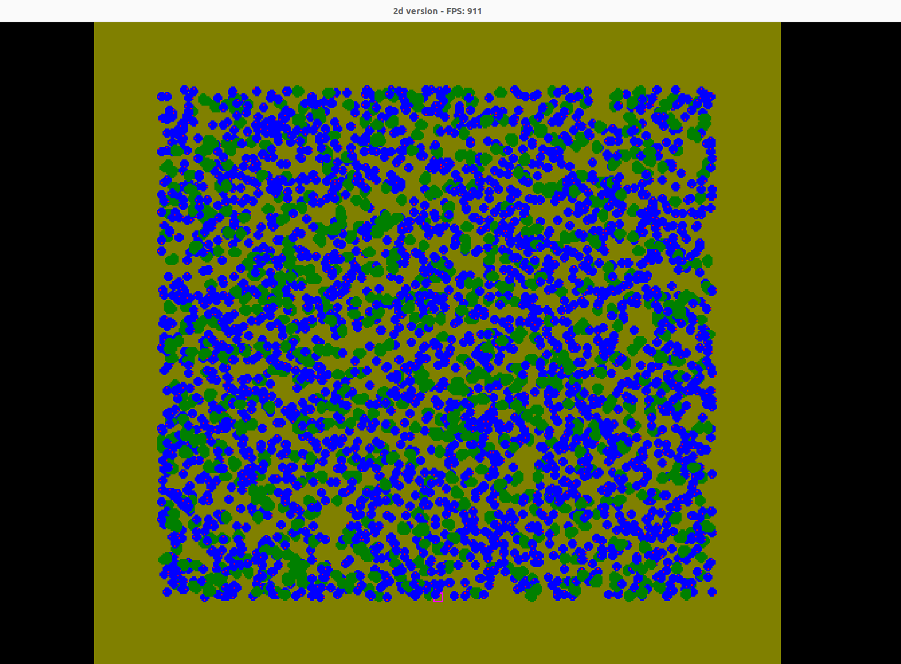
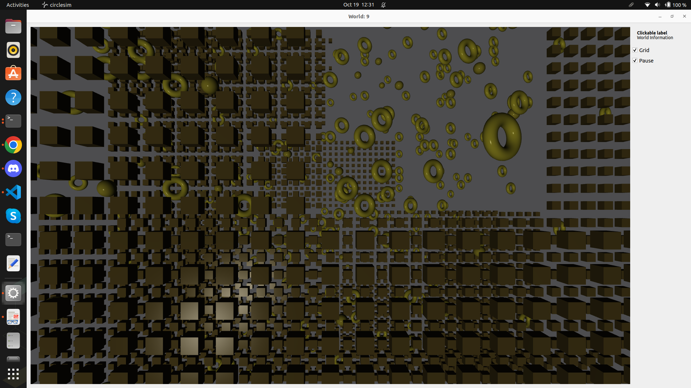

# Simulation/Game prototype with 2D and 3D viewers

## Features
* Each "world" is an indpendently simulated thing
* Active world can be toggled with a key
* Change 2d and 3d views with a compile flag

## Code Notes
* Game object separate from any particular engine
* State pattern for each Actor, making addition of new ones relatively easy
* Command pattern to separate Action creation and execution
* 2D viewer with One Lone Coder pixel game engine
* 3D viewer with Qt6::3DExtras

## Screenshots
* Look at [Screenshots folder](./screenshots/) for images and videos

## Inspiration
* Inspired by the questions
  * "If I had to write a CAT scan or MRI scan viewer for volumetric data could I do it?"
  * "Can I abstract a Game object so that multiple renders can be hooked up in the same codebase?"
